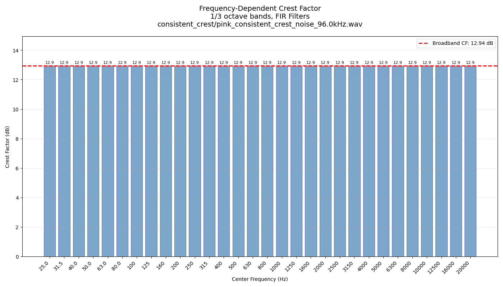
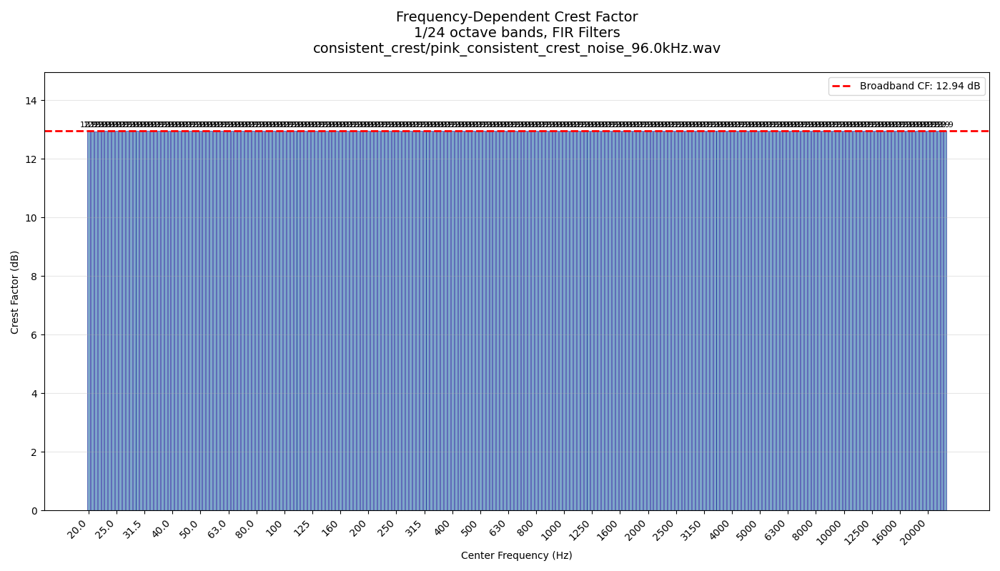
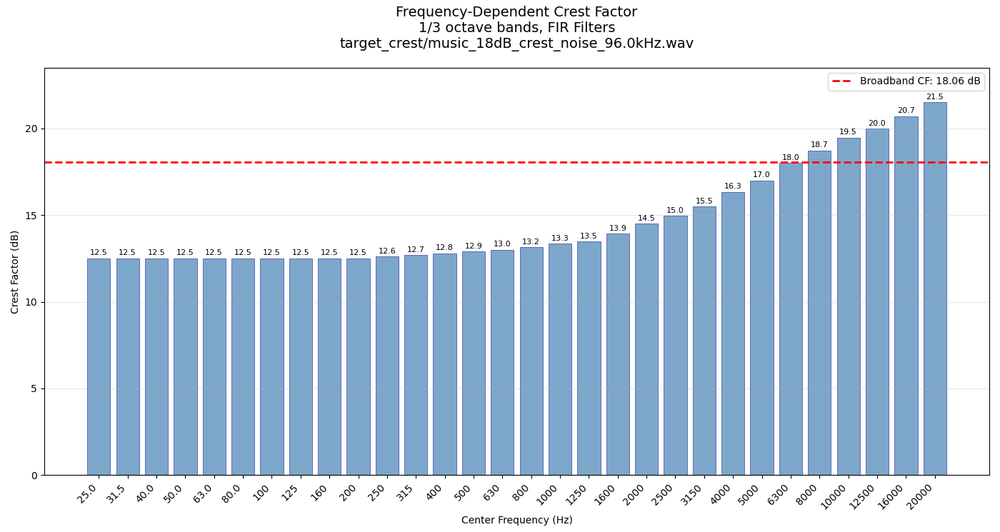
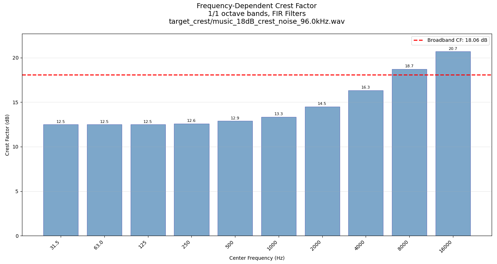
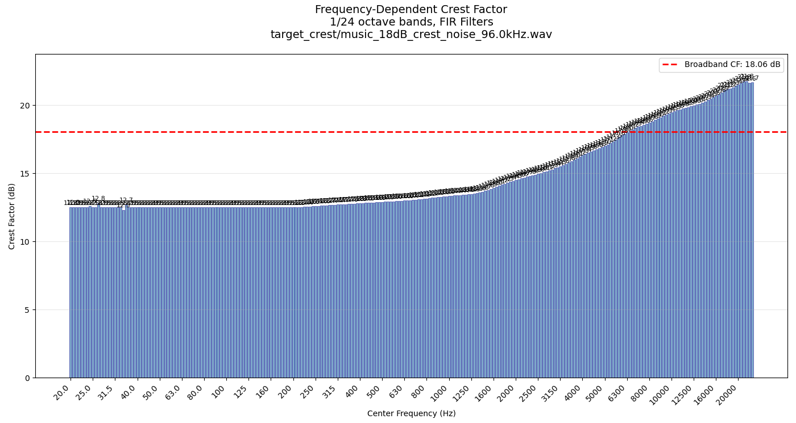

# Generating Noise Signals with Specific Crest Factors

This is a research project around crest factor in noise signals (specifically frequency-dependent crest factors) and **generating noise signals with specific crest factors**. It includes code and pre-generated (hopefully reproducible) noise signals.

**This is research code, it is highly experimental. Here be dragons. Assume everything is evil and wants to eat your cats and dogs**

The generated noise is mainly Periodic Noise, i.e. noise that is synthesized from an inverse FFT and not pseudorandom noise. This has some advantages when you perform measurements (i.e. spectrum is correct without lots of averaging).


Main Files:
- `generate_arbitrary_freq_dependent_crest.py`: Extremely versatile tool to generate noise signals with specific frequency dependent crest factors!
- `generate_simple_broadband_crest_gradient_free.py`: Original simpler tool to generate noise signals with a specific broadband crest factor.
- `target_crest` directory: Contains pre-generated noise signals with specific frequency-dependent crest factors (`--objective-mode target` in `generate_arbitrary_freq_dependent_crest.py`).
- `consistent_crest` directory: Contains pre-generated noise signals with consistent crest factors across frequency bands (`--objective-mode consistent` in `generate_arbitrary_freq_dependent_crest.py`).

Utility Files:
- `freq_dependent_crest_factors.py`: Tool for analyzing frequency-dependent crest factors of signals.
- `iec-60268-filters.py`: Plots the filter response of the IEC-60268-16 A.6.1 Speech Noise filter, hoping that I understood the standard correctly.
- `wav_stats.py`: Prints some statistics about a WAV file, such as sample rate, number of channels, duration, and crest factor.


(`Music-Noise_96kHz.wav` is not included for copyright reasons, but you can download it from https://www.aes.org/standards/AES75/)

## Working principle

### Noise Generators
The tools use the numeric steam hammer, aka gradient-based and gradient-free optimization, to find a phase spectrum that results in the desired crest factor(s).

For more details, check the docstrings in the code files.

### Frequency Dependent Crest Factor Calculation

We calculate the frequency-dependent crest factor by "splitting" the signal into fractional octave bands (1/1, 1/3, 1/6, 1/12, or 1/24 octave, based on standard center frequencies) using FIR or IIR filters and then simply calculate the crest factor in each band using the normal crest factor formula applied to the filtered signal.

This reveals how the crest factor varies across the frequency spectrum, rather than just providing a single broadband value.

For FIR filtering, we use linear-phase FIR filters designed using scipy's `signal.firwin` function (bandpass filter designw with the window method and Hamming window).

For IIR filtering, we use 6th-order Butterworth filters designed using scipy's `signal.butter` function. Those are NOT linear phase! This is to emulate the behaviour of real-world audio equipment more closely, which often uses IIR filters. This matches  IEC 1260 / IEC 61260 / recommendations for fractional octave filters.

**I strongly recommend using FIR!!** The phase distortion of IIR filters can lead to unexpected results, especially when analyzing crest factors. But this is a different, more general topic and MUCH more complex topic (Is Crest Factor even a good or meaningful metric? The answer is: No, it is probably not.)

## Demo results

### Pink Noise, Consistent Crest Factor, 1/3 Octave Bands

`python3 freq_dependent_crest_factor.py --fraction 3 --plot consistent_crest/pink_consistent_crest_noise_96.0kHz.wav`



<details>

<summary>Full Output</summary>

```
Filtering signal in 30 bands using FIR filters... Using FFT length: 1048576 (original signal length: 1048576, filter length: 65536)
Done!
Calculating crest factors... Done!

Frequency-Dependent Crest Factor Analysis
=========================================
File: consistent_crest/pink_consistent_crest_noise_96.0kHz.wav
Sample rate: 96000 Hz
Duration: 10.92 seconds (1,048,576 samples)
Filter type: fir
Fractional octave: 1/3

Results:
Center Freq (Hz) | Crest Factor (dB)
----------------------------------------------------------------------
           25.0 |            12.938dB
           31.5 |            12.939dB
           40.0 |            12.938dB
           50.0 |            12.938dB
           63.0 |            12.938dB
           80.0 |            12.938dB
          100.0 |            12.938dB
          125.0 |            12.938dB
          160.0 |            12.938dB
          200.0 |            12.938dB
          250.0 |            12.938dB
          315.0 |            12.938dB
          400.0 |            12.938dB
          500.0 |            12.938dB
          630.0 |            12.938dB
          800.0 |            12.938dB
         1000.0 |            12.938dB
         1250.0 |            12.938dB
         1600.0 |            12.938dB
         2000.0 |            12.938dB
         2500.0 |            12.938dB
         3150.0 |            12.938dB
         4000.0 |            12.938dB
         5000.0 |            12.938dB
         6300.0 |            12.938dB
         8000.0 |            12.938dB
        10000.0 |            12.938dB
        12500.0 |            12.938dB
        16000.0 |            12.938dB
        20000.0 |            12.938dB
----------------------------------------------------------------------
      Broadband |             12.94dB
```
</details>

### Pink Noise, Consistent Crest Factor, 1/24 Octave Bands

`python3 freq_dependent_crest_factor.py --fraction 24 --plot consistent_crest/pink_consistent_crest_noise_96.0kHz.wav`



<details>

<summary>Full Output</summary>

```
Filtering signal in 246 bands using FIR filters... Using FFT length: 1048576 (original signal length: 1048576, filter length: 65536)
Done!
Calculating crest factors... Done!

Frequency-Dependent Crest Factor Analysis
=========================================
File: consistent_crest/pink_consistent_crest_noise_96.0kHz.wav
Sample rate: 96000 Hz
Duration: 10.92 seconds (1,048,576 samples)
Filter type: fir
Fractional octave: 1/24

Results:
Center Freq (Hz) | Crest Factor (dB)
----------------------------------------------------------------------
           20.0 |            12.938dB
           20.6 |            12.943dB
           21.2 |            12.928dB
           21.8 |            12.948dB
           22.4 |            12.935dB
           23.0 |            12.938dB
           23.6 |            12.940dB
           24.3 |            12.941dB
           25.0 |            12.934dB
           25.8 |            12.942dB
           26.5 |            12.936dB
           27.2 |            12.937dB
           28.0 |            12.939dB
           29.0 |            12.937dB
           30.0 |            12.937dB
           30.7 |            12.938dB
           31.5 |            12.938dB
           32.5 |            12.938dB
           33.5 |            12.939dB
           34.5 |            12.939dB
           35.5 |            12.939dB
           36.5 |            12.938dB
           37.5 |            12.939dB
           38.7 |            12.938dB
           40.0 |            12.938dB
           41.2 |            12.938dB
           42.5 |            12.937dB
           43.7 |            12.939dB
           45.0 |            12.938dB
           46.2 |            12.938dB
           47.5 |            12.939dB
           48.7 |            12.937dB
           50.0 |            12.939dB
           51.5 |            12.938dB
           53.0 |            12.938dB
           54.5 |            12.939dB
           56.0 |            12.938dB
           58.0 |            12.938dB
           60.0 |            12.939dB
           61.5 |            12.938dB
           63.0 |            12.938dB
           65.0 |            12.938dB
           67.0 |            12.938dB
           69.0 |            12.938dB
           71.0 |            12.938dB
           73.0 |            12.938dB
           75.0 |            12.938dB
           77.5 |            12.938dB
           80.0 |            12.938dB
           82.5 |            12.938dB
           85.0 |            12.938dB
           87.5 |            12.938dB
           90.0 |            12.938dB
           92.5 |            12.938dB
           95.0 |            12.938dB
           97.5 |            12.938dB
          100.0 |            12.938dB
          103.0 |            12.938dB
          106.0 |            12.938dB
          109.0 |            12.938dB
          112.0 |            12.938dB
          115.0 |            12.938dB
          118.0 |            12.938dB
          122.0 |            12.938dB
          125.0 |            12.938dB
          128.0 |            12.938dB
          132.0 |            12.938dB
          136.0 |            12.938dB
          140.0 |            12.938dB
          145.0 |            12.938dB
          150.0 |            12.938dB
          155.0 |            12.938dB
          160.0 |            12.938dB
          165.0 |            12.938dB
          170.0 |            12.938dB
          175.0 |            12.938dB
          180.0 |            12.938dB
          185.0 |            12.938dB
          190.0 |            12.938dB
          195.0 |            12.938dB
          200.0 |            12.938dB
          206.0 |            12.938dB
          212.0 |            12.938dB
          218.0 |            12.938dB
          224.0 |            12.938dB
          230.0 |            12.938dB
          236.0 |            12.938dB
          243.0 |            12.938dB
          250.0 |            12.938dB
          258.0 |            12.938dB
          265.0 |            12.938dB
          272.0 |            12.938dB
          280.0 |            12.938dB
          290.0 |            12.938dB
          300.0 |            12.938dB
          307.0 |            12.938dB
          315.0 |            12.938dB
          325.0 |            12.938dB
          335.0 |            12.938dB
          345.0 |            12.938dB
          355.0 |            12.938dB
          365.0 |            12.938dB
          375.0 |            12.938dB
          387.0 |            12.938dB
          400.0 |            12.938dB
          412.0 |            12.938dB
          425.0 |            12.938dB
          437.0 |            12.938dB
          450.0 |            12.938dB
          462.0 |            12.938dB
          475.0 |            12.938dB
          487.0 |            12.938dB
          500.0 |            12.938dB
          515.0 |            12.938dB
          530.0 |            12.938dB
          545.0 |            12.938dB
          560.0 |            12.938dB
          580.0 |            12.938dB
          600.0 |            12.938dB
          615.0 |            12.938dB
          630.0 |            12.938dB
          650.0 |            12.938dB
          670.0 |            12.938dB
          690.0 |            12.938dB
          710.0 |            12.938dB
          730.0 |            12.938dB
          750.0 |            12.938dB
          775.0 |            12.938dB
          800.0 |            12.938dB
          825.0 |            12.938dB
          850.0 |            12.938dB
          875.0 |            12.938dB
          900.0 |            12.938dB
          925.0 |            12.938dB
          950.0 |            12.938dB
          975.0 |            12.938dB
         1000.0 |            12.938dB
         1030.0 |            12.938dB
         1060.0 |            12.938dB
         1090.0 |            12.938dB
         1120.0 |            12.938dB
         1150.0 |            12.938dB
         1180.0 |            12.938dB
         1220.0 |            12.938dB
         1250.0 |            12.938dB
         1280.0 |            12.938dB
         1320.0 |            12.938dB
         1360.0 |            12.938dB
         1400.0 |            12.938dB
         1450.0 |            12.938dB
         1500.0 |            12.938dB
         1550.0 |            12.938dB
         1600.0 |            12.938dB
         1650.0 |            12.938dB
         1700.0 |            12.938dB
         1750.0 |            12.938dB
         1800.0 |            12.938dB
         1850.0 |            12.938dB
         1900.0 |            12.938dB
         1950.0 |            12.938dB
         2000.0 |            12.938dB
         2060.0 |            12.938dB
         2120.0 |            12.938dB
         2180.0 |            12.938dB
         2240.0 |            12.938dB
         2300.0 |            12.938dB
         2360.0 |            12.938dB
         2430.0 |            12.938dB
         2500.0 |            12.938dB
         2580.0 |            12.938dB
         2650.0 |            12.938dB
         2720.0 |            12.938dB
         2800.0 |            12.938dB
         2900.0 |            12.938dB
         3000.0 |            12.938dB
         3070.0 |            12.938dB
         3150.0 |            12.938dB
         3250.0 |            12.938dB
         3350.0 |            12.938dB
         3450.0 |            12.938dB
         3550.0 |            12.938dB
         3650.0 |            12.938dB
         3750.0 |            12.938dB
         3870.0 |            12.938dB
         4000.0 |            12.938dB
         4120.0 |            12.938dB
         4250.0 |            12.938dB
         4370.0 |            12.938dB
         4500.0 |            12.938dB
         4620.0 |            12.938dB
         4750.0 |            12.938dB
         4870.0 |            12.938dB
         5000.0 |            12.938dB
         5150.0 |            12.938dB
         5300.0 |            12.938dB
         5450.0 |            12.938dB
         5600.0 |            12.938dB
         5800.0 |            12.938dB
         6000.0 |            12.938dB
         6150.0 |            12.938dB
         6300.0 |            12.938dB
         6500.0 |            12.938dB
         6700.0 |            12.938dB
         6900.0 |            12.938dB
         7100.0 |            12.938dB
         7300.0 |            12.938dB
         7500.0 |            12.938dB
         7750.0 |            12.938dB
         8000.0 |            12.938dB
         8250.0 |            12.938dB
         8500.0 |            12.938dB
         8750.0 |            12.938dB
         9000.0 |            12.938dB
         9250.0 |            12.938dB
         9500.0 |            12.938dB
         9750.0 |            12.938dB
        10000.0 |            12.938dB
        10300.0 |            12.938dB
        10600.0 |            12.938dB
        10900.0 |            12.938dB
        11200.0 |            12.938dB
        11500.0 |            12.938dB
        11800.0 |            12.938dB
        12200.0 |            12.938dB
        12500.0 |            12.938dB
        12800.0 |            12.938dB
        13200.0 |            12.938dB
        13600.0 |            12.938dB
        14000.0 |            12.938dB
        14500.0 |            12.938dB
        15000.0 |            12.938dB
        15500.0 |            12.938dB
        16000.0 |            12.938dB
        16500.0 |            12.938dB
        17000.0 |            12.938dB
        17500.0 |            12.938dB
        18000.0 |            12.938dB
        18500.0 |            12.938dB
        19000.0 |            12.938dB
        19500.0 |            12.938dB
        20000.0 |            12.938dB
        20600.0 |            12.938dB
        21200.0 |            12.938dB
        21800.0 |            12.938dB
        22400.0 |            12.938dB
        23000.0 |            12.938dB
----------------------------------------------------------------------
      Broadband |             12.94dB
```
</details>


### Music Noise (inspired), Target Crest Factor, 1/3 Octave Bands

`python3 freq_dependent_crest_factor.py --fraction 3 --plot target_crest/music_18dB_crest_noise_96.0kHz.wav`



<details>

<summary>Full Output</summary>

```
Filtering signal in 30 bands using FIR filters... Using FFT length: 1048576 (original signal length: 1048576, filter length: 65536)
Done!
Calculating crest factors... Done!

Frequency-Dependent Crest Factor Analysis
=========================================
File: target_crest/music_18dB_crest_noise_96.0kHz.wav
Sample rate: 96000 Hz
Duration: 10.92 seconds (1,048,576 samples)
Filter type: fir
Fractional octave: 1/3

Results:
Center Freq (Hz) | Crest Factor (dB)
----------------------------------------------------------------------
           25.0 |            12.500dB
           31.5 |            12.500dB
           40.0 |            12.500dB
           50.0 |            12.500dB
           63.0 |            12.500dB
           80.0 |            12.500dB
          100.0 |            12.500dB
          125.0 |            12.500dB
          160.0 |            12.500dB
          200.0 |            12.500dB
          250.0 |            12.600dB
          315.0 |            12.700dB
          400.0 |            12.800dB
          500.0 |            12.900dB
          630.0 |            13.000dB
          800.0 |            13.150dB
         1000.0 |            13.343dB
         1250.0 |            13.478dB
         1600.0 |            13.935dB
         2000.0 |            14.500dB
         2500.0 |            14.962dB
         3150.0 |            15.503dB
         4000.0 |            16.334dB
         5000.0 |            17.000dB
         6300.0 |            18.000dB
         8000.0 |            18.726dB
        10000.0 |            19.462dB
        12500.0 |            19.986dB
        16000.0 |            20.700dB
        20000.0 |            21.505dB
----------------------------------------------------------------------
      Broadband |             18.06dB
```

</details>


### Music Noise (inspired), Target Crest Factor, 1 Octave Bands

`python3 freq_dependent_crest_factor.py --fraction 1 --plot target_crest/music_18dB_crest_noise_96.0kHz.wav`



<details>

<summary>Full Output</summary>

```
Filtering signal in 10 bands using FIR filters... Using FFT length: 1048576 (original signal length: 1048576, filter length: 65536)
Done!
Calculating crest factors... Done!

Frequency-Dependent Crest Factor Analysis
=========================================
File: target_crest/music_18dB_crest_noise_96.0kHz.wav
Sample rate: 96000 Hz
Duration: 10.92 seconds (1,048,576 samples)
Filter type: fir
Fractional octave: 1/1

Results:
Center Freq (Hz) | Crest Factor (dB)
----------------------------------------------------------------------
           31.5 |            12.500dB
           63.0 |            12.500dB
          125.0 |            12.500dB
          250.0 |            12.600dB
          500.0 |            12.900dB
         1000.0 |            13.343dB
         2000.0 |            14.500dB
         4000.0 |            16.334dB
         8000.0 |            18.726dB
        16000.0 |            20.700dB
----------------------------------------------------------------------
      Broadband |             18.06dB
```

</details>

### Music Noise (inspired), Target Crest Factor, 1/24 Octave Bands

`python3 freq_dependent_crest_factor.py --fraction 24 --plot target_crest/music_18dB_crest_noise_96.0kHz.wav`



<details>

<summary>Full Output</summary>

```
Filtering signal in 246 bands using FIR filters... Using FFT length: 1048576 (original signal length: 1048576, filter length: 65536)
Done!
Calculating crest factors... Done!

Frequency-Dependent Crest Factor Analysis
=========================================
File: target_crest/music_18dB_crest_noise_96.0kHz.wav
Sample rate: 96000 Hz
Duration: 10.92 seconds (1,048,576 samples)
Filter type: fir
Fractional octave: 1/24

Results:
Center Freq (Hz) | Crest Factor (dB)
----------------------------------------------------------------------
           20.0 |            12.500dB
           20.6 |            12.525dB
           21.2 |            12.499dB
           21.8 |            12.500dB
           22.4 |            12.500dB
           23.0 |            12.500dB
           23.6 |            12.497dB
           24.3 |            12.607dB
           25.0 |            12.497dB
           25.8 |            12.493dB
           26.5 |            12.813dB
           27.2 |            12.500dB
           28.0 |            12.500dB
           29.0 |            12.500dB
           30.0 |            12.500dB
           30.7 |            12.500dB
           31.5 |            12.500dB
           32.5 |            12.513dB
           33.5 |            12.500dB
           34.5 |            12.317dB
           35.5 |            12.699dB
           36.5 |            12.500dB
           37.5 |            12.500dB
           38.7 |            12.500dB
           40.0 |            12.500dB
           41.2 |            12.500dB
           42.5 |            12.500dB
           43.7 |            12.498dB
           45.0 |            12.500dB
           46.2 |            12.500dB
           47.5 |            12.500dB
           48.7 |            12.500dB
           50.0 |            12.500dB
           51.5 |            12.500dB
           53.0 |            12.500dB
           54.5 |            12.500dB
           56.0 |            12.500dB
           58.0 |            12.500dB
           60.0 |            12.500dB
           61.5 |            12.500dB
           63.0 |            12.500dB
           65.0 |            12.500dB
           67.0 |            12.500dB
           69.0 |            12.500dB
           71.0 |            12.500dB
           73.0 |            12.500dB
           75.0 |            12.500dB
           77.5 |            12.500dB
           80.0 |            12.500dB
           82.5 |            12.500dB
           85.0 |            12.500dB
           87.5 |            12.500dB
           90.0 |            12.500dB
           92.5 |            12.500dB
           95.0 |            12.500dB
           97.5 |            12.500dB
          100.0 |            12.500dB
          103.0 |            12.500dB
          106.0 |            12.500dB
          109.0 |            12.500dB
          112.0 |            12.500dB
          115.0 |            12.500dB
          118.0 |            12.500dB
          122.0 |            12.500dB
          125.0 |            12.500dB
          128.0 |            12.500dB
          132.0 |            12.500dB
          136.0 |            12.501dB
          140.0 |            12.501dB
          145.0 |            12.501dB
          150.0 |            12.501dB
          155.0 |            12.501dB
          160.0 |            12.500dB
          165.0 |            12.499dB
          170.0 |            12.497dB
          175.0 |            12.495dB
          180.0 |            12.494dB
          185.0 |            12.494dB
          190.0 |            12.494dB
          195.0 |            12.496dB
          200.0 |            12.500dB
          206.0 |            12.507dB
          212.0 |            12.516dB
          218.0 |            12.527dB
          224.0 |            12.540dB
          230.0 |            12.554dB
          236.0 |            12.568dB
          243.0 |            12.584dB
          250.0 |            12.600dB
          258.0 |            12.617dB
          265.0 |            12.630dB
          272.0 |            12.642dB
          280.0 |            12.654dB
          290.0 |            12.668dB
          300.0 |            12.682dB
          307.0 |            12.690dB
          315.0 |            12.700dB
          325.0 |            12.712dB
          335.0 |            12.724dB
          345.0 |            12.736dB
          355.0 |            12.748dB
          365.0 |            12.760dB
          375.0 |            12.772dB
          387.0 |            12.785dB
          400.0 |            12.800dB
          412.0 |            12.813dB
          425.0 |            12.827dB
          437.0 |            12.840dB
          450.0 |            12.853dB
          462.0 |            12.865dB
          475.0 |            12.877dB
          487.0 |            12.888dB
          500.0 |            12.900dB
          515.0 |            12.913dB
          530.0 |            12.925dB
          545.0 |            12.937dB
          560.0 |            12.948dB
          580.0 |            12.963dB
          600.0 |            12.978dB
          615.0 |            12.989dB
          630.0 |            13.000dB
          650.0 |            13.016dB
          670.0 |            13.032dB
          690.0 |            13.048dB
          710.0 |            13.065dB
          730.0 |            13.083dB
          750.0 |            13.101dB
          775.0 |            13.125dB
          800.0 |            13.150dB
          825.0 |            13.176dB
          850.0 |            13.202dB
          875.0 |            13.228dB
          900.0 |            13.254dB
          925.0 |            13.279dB
          950.0 |            13.302dB
          975.0 |            13.324dB
         1000.0 |            13.343dB
         1030.0 |            13.363dB
         1060.0 |            13.379dB
         1090.0 |            13.394dB
         1120.0 |            13.407dB
         1150.0 |            13.420dB
         1180.0 |            13.435dB
         1220.0 |            13.457dB
         1250.0 |            13.478dB
         1280.0 |            13.503dB
         1320.0 |            13.542dB
         1360.0 |            13.587dB
         1400.0 |            13.638dB
         1450.0 |            13.707dB
         1500.0 |            13.780dB
         1550.0 |            13.857dB
         1600.0 |            13.935dB
         1650.0 |            14.012dB
         1700.0 |            14.089dB
         1750.0 |            14.163dB
         1800.0 |            14.236dB
         1850.0 |            14.306dB
         1900.0 |            14.374dB
         1950.0 |            14.439dB
         2000.0 |            14.500dB
         2060.0 |            14.568dB
         2120.0 |            14.632dB
         2180.0 |            14.691dB
         2240.0 |            14.747dB
         2300.0 |            14.800dB
         2360.0 |            14.850dB
         2430.0 |            14.907dB
         2500.0 |            14.962dB
         2580.0 |            15.025dB
         2650.0 |            15.080dB
         2720.0 |            15.136dB
         2800.0 |            15.200dB
         2900.0 |            15.282dB
         3000.0 |            15.368dB
         3070.0 |            15.430dB
         3150.0 |            15.503dB
         3250.0 |            15.599dB
         3350.0 |            15.699dB
         3450.0 |            15.801dB
         3550.0 |            15.903dB
         3650.0 |            16.005dB
         3750.0 |            16.105dB
         3870.0 |            16.219dB
         4000.0 |            16.334dB
         4120.0 |            16.430dB
         4250.0 |            16.524dB
         4370.0 |            16.604dB
         4500.0 |            16.687dB
         4620.0 |            16.760dB
         4750.0 |            16.839dB
         4870.0 |            16.914dB
         5000.0 |            17.000dB
         5150.0 |            17.107dB
         5300.0 |            17.222dB
         5450.0 |            17.341dB
         5600.0 |            17.463dB
         5800.0 |            17.626dB
         6000.0 |            17.784dB
         6150.0 |            17.896dB
         6300.0 |            18.000dB
         6500.0 |            18.124dB
         6700.0 |            18.231dB
         6900.0 |            18.326dB
         7100.0 |            18.410dB
         7300.0 |            18.486dB
         7500.0 |            18.556dB
         7750.0 |            18.641dB
         8000.0 |            18.726dB
         8250.0 |            18.816dB
         8500.0 |            18.910dB
         8750.0 |            19.007dB
         9000.0 |            19.104dB
         9250.0 |            19.200dB
         9500.0 |            19.293dB
         9750.0 |            19.381dB
        10000.0 |            19.462dB
        10300.0 |            19.549dB
        10600.0 |            19.626dB
        10900.0 |            19.695dB
        11200.0 |            19.756dB
        11500.0 |            19.812dB
        11800.0 |            19.866dB
        12200.0 |            19.934dB
        12500.0 |            19.986dB
        12800.0 |            20.040dB
        13200.0 |            20.116dB
        13600.0 |            20.194dB
        14000.0 |            20.276dB
        14500.0 |            20.380dB
        15000.0 |            20.487dB
        15500.0 |            20.595dB
        16000.0 |            20.700dB
        16500.0 |            20.805dB
        17000.0 |            20.908dB
        17500.0 |            21.107dB
        18000.0 |            21.175dB
        18500.0 |            21.209dB
        19000.0 |            21.309dB
        19500.0 |            21.408dB
        20000.0 |            21.506dB
        20600.0 |            21.625dB
        21200.0 |            21.762dB
        21800.0 |            21.771dB
        22400.0 |            21.617dB
        23000.0 |            21.671dB
----------------------------------------------------------------------
      Broadband |             18.06dB
```

</details>